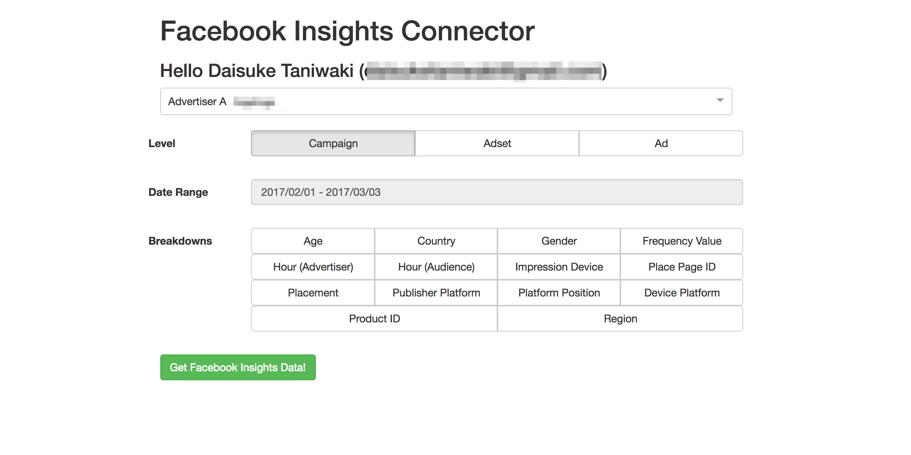

# FacebookInsightsConnector

[![Build Status][build-image]][build-link]

The [Web Data Connector](https://tableau.github.io/webdataconnector/) for Facebook Insights.



## Install

```bash
npm install
```

### Settings

```bash
cp .env.sample .env
```

Then, Set up the envs for yourself.

## Development

```bash
PORT=8080 npm start
```

### Simulator

Tableau provides the [simulator](https://github.com/tableau/webdataconnector) before trying plugins in Tableau Desktop.

```bash
git clone https://github.com/tableau/webdataconnector.git
cd webdataconnector
npm install --production
npm start
open http://localhost:8888/Simulator/index.html
```

Set `http://localhost:8080/` at WDC URL of the UI.

### Lint

Lint the code to align the coding styles.

```bash
npm run lint
npm run lint-fix # Fix lint errors automatically
```

## Production

### Deploy

```bash
npm run deploy
```

It automatically publish the app to S3.

## Test

```bash
npm run test
```

## Contributing

1. Fork it
2. Create your feature branch (`git checkout -b my-new-feature`)
3. Commit your changes (`git commit -am 'Add some feature'`)
4. Push to the branch (`git push origin my-new-feature`)
5. Create new [Pull Request](../../pull/new/master)

## Copyright

Copyright (c) 2017 KAIZEN platform. See [LICENSE](LICENSE) for details.


[build-image]: https://circleci.com/gh/kaizenplatform/FacebookInsightsConnector.svg?style=svg
[build-link]:  https://circleci.com/gh/kaizenplatform/FacebookInsightsConnector

